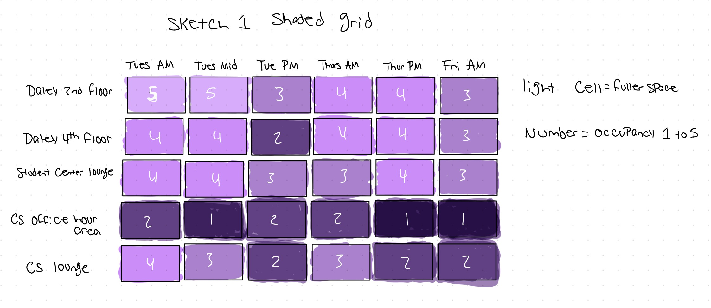
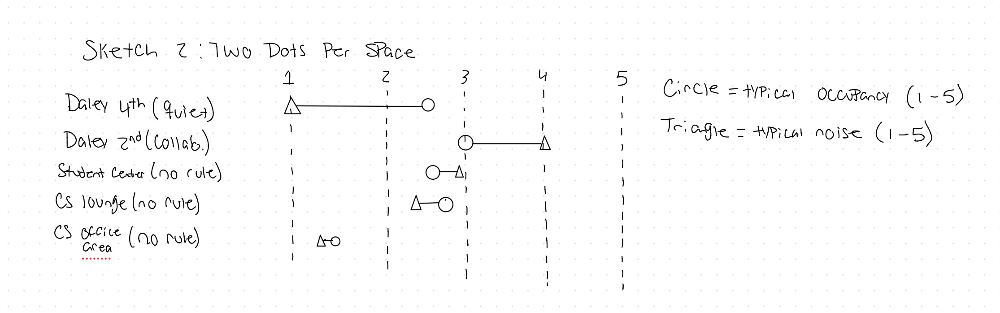
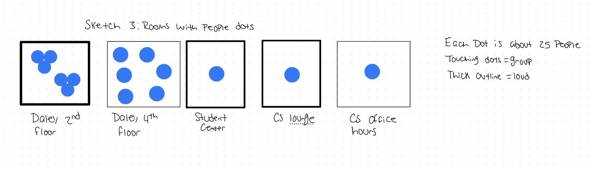

# cs424-assignment1

## Task 1: Observation and data collection plan

**What I want to observe and why it's interesting.**
I want to observe how students use different study spaces on campus and how that use changes across places, days and times of days. For me personally when I have to study I usually have to guess where to go. Will the library be packed? Is the quiet floor really quiet? Will the lounge be too loud to focus? I never know for sure. In the library the wall signs say "quiet zone" and "collaborative zone" but that doesn't tell me if people actually follow those policies. I decided to visit the same spaces over and over and write down how full, how loud, and how social each one was. That way I could figure out which spaces I can count on at different times. I picked spaces that are different from each other such as, two floors from the library, a lounge in the student center, a lounge in the CS building, and the office hour area. This lets me compare places as well as times of day.

**Initial domain questions**

How does occupancy change across the day and the week in each space? Do some spaces fill up at predictable times while others stay quiet?

Do spaces follow their posted policy? is a quiet zone actually quieter than a collaborative zone, and what about spaces with no rule?

Is noise mostly explained by how many people are in a space, or do some spaces stay quiet or loud no matter how crowded they are?

How does the mix of people working alone compared to in groups change across spaces and time, and does it relate to how loud the space is?

** Data collection plan**

I plan to collect my data by visiting 5 study spaces and writing down what each one is like at that moment. One observation will be one visit of about 5 minutes to one space. At each visit I will record how full the space is, how loud it is, and whether people are mostly alone or in groups. I will estimate how many people are there and write a some notes about what I see and hear. For every visit I will note the building, the exact space, and the posted rule whether a quiet zone, collaborative zone, or no posted rule. The spaces I chose were based off my life as a student. Most of my classes are in the CS building, and I want to find good places there to study, so the places I will look at is the lounge, and the office hour area. I usually study in the library during my 1 hour break, the 2nd floor of the library is full and loud, so I go to the 4th floor, which I find to be full also but it's much quieter. I'm adding the Student Center lounge to see if there is a good place to study near the food area. I also want a mix of space types and posted rules so I can compare them.

I will collect data on a few different days and  go whenever I have a break between classes. I don't have class on Fridays so I plan to collect in the morning that day. What I'm going to do every time is look around, rate the space, estimate the head count, and write some notes of what I see. I think I'll have a couple weak spots since it's a few days out of the week, and I will only visit during the day so I'll miss evenings and weekends. I picked spaces I already know so there could be better spots I am not aware of. My ratings and head counts will be my own estimates. Since my schedule decides when I go some spaces I visit could be at different times than others.

| Attribute | Type | Description | Example |
|---|---|---|---|
| obs_id | Identifier | Unique number for each observation | 12 |
| building | Categorical | Building the space is in | Library |
| location | Categorical | Space observed | Daley 2nd Floor |
| space_type | Categorical | Kind of space: Library, Lounge, or Office Hour Area | Library |
| posted_policy | Categorical | Rule posted in the space: Quiet Zone, Collaborative zone, or No posted rule | Quiet Zone |
| date | Temporal | Date of observation (YYYY-MM-DD) | 2026-10-01 |
| day_of_week | Ordinal | Day of the week | Thursday | 
| time | Temporal | Start time of observation | 1:05PM |
| occupancy_level | Ordinal | How full the space was, from 1 (mostly empty) to 5 (completely full) | 4 |
| noise_level | Ordinal | How loud the space was, from 1 (silent apart from typing), to 5 (very loud) | 2 |
| group_solo | Ordinal | Mix of people working alone or in groups, from 1 (everyone is solo) to 5 (mostly groups) | 3 |
| head_count_min | Quantitative | Lowest estimate of people present | 150 |
| head_count_max | Quantitative | Highest estimate of people present | 170 |
| minutes_to_record | Quantitative | Minutes spent observing | 5 |
| occupancy_notes | Text | My wording for the occupancy rating | Mostly full, couple of seats empty |
| noise_note | Text | My wording for noise rating | Can hear people talking, not yelling | 
| group_solo_notes | Text | My wording for solo/group rating | Most people are in groups |

## Task 2: Pilot and data collection

In my pilot collection the easy attributes to record were posted policy, space type, time, and noise level. Occupancy level, head count, and the solo versus group mix were harder, because I had to walk around and estimate. If I had teammates, I think they would have come up with different numbers for those, since they were my own estimates. I didn't feel any important attribute was missing, a unnecessary attribute would be the minutes to record. The pilot didn't change which questions I thought I could answer. It did help me plan how much data to collect. For the full dataset I recorded 30 observations of about five minutes each at five spaces, the 2nd and 4th floors of the library, the Student Center lounge, the CS building lounge, and the CS building office hour area. I went on Tuesday, September 29, Thursday, October 1, and Friday, October 2, going whenever I had a break and on Friday morning. After I collected my data I made a few changes. I turned my written descriptions of occupancy, noise, and the people mix into 1 to 5 scores and kept my original wording in notes columns. I turned my head counts into min and max estimates.

## Task 3: Data descriptions and domain questions

My dataset has 30 observations from five study spaces, the 2nd and 4th floors of the library, the Student Center lounge, the CS building lounge, and the CS building office hour area. I collected data in rounds I visited all five spaces within about an hour, three rounds on Tuesday, two on Thursday, and one on Friday morning. Each observation has the space, its type and posted rule, the date and time, 1 to 5 ratings for occupancy, noise, and the solo versus group mix, a head count range, and my original notes. The spaces changed a lot, from nearly empty the office hour area, with 5 to 20 people to full the library floors, with 100 to 200. For time/dates I saw only three days, nothing in the evening, and Friday has just one round. The limits are that every rating and count is my own estimate, and that each posted rule belongs to just one space. The quiet zone is only the library's 4th floor and the collaborative zone is only the 2nd floor, so I can't separate the effect of the rule from the effect of the space. Occupancy, head count, and the solo versus group mix were also the hardest to record. Turning a visit into a row meant I had to squeeze a lot into a few numbers. My attributes captured how full, how loud, and how social each space was, but they lost the kind of noise, how long people stayed, and how many seats the space had. I kept my written notes to preserve some detail but the 1 to 5 scores flatten it.

1. How does occupancy change across the day in each space? The library floors were busiest around midday on Tuesday and dropped by late afternoon, while the office hour area stayed mostly empty. This uses date, time, location, and occupancy level. I changed this from "day and week" to "across the day," because three days isn't enough to say much about the week.

2. Do spaces follow their posted policy? In the library they did, the 4th floor (quiet zone) had a noise level of 1 every time, while the 2nd floor (collaborative zone) was a 3 to 5. I can't tell whether the rule or the space causes this, since each rule belongs to one space. This uses posted policy, location, and noise level.

3. Is noise explained by how many people are there? No not quite the quiet 4th floor had 120 to 200 people but a noise level of 1, while the CS lounge with about 15 to 25 people was a 2 or 3. This compares the head count and the occupancy against noise level by space.

4. How does the solo versus group mix relate to noise? Spaces with more groups were louder, and my two ratings moved together closely. Since the differences are mostly between spaces and not between visits this can say more about the type of space than about group work itself. It uses the people rating, noise level, location, and time.

## Task 4: Task abstractions

1. How does occupancy change across the day in each space? The action is to compare, and the target is trends in occupancy over time one for each space. Someone using the visualization needs to see when each space peaks or drops off and how those shapes differ between spaces, so they are comparing trends, not reading single values. Because I only have a few visits per day it is also partly about finding the extremes meaning the busiest and emptiest times.

2. Do spaces follow their posted policy? The action is to compare, and the target is the distribution of noise levels across categories of posted policy and across spaces. It is also a verification task since I'm checking an expectation where a quiet zone should be quiet against what I observed. The person also needs to spot outliers, like a visit that was louder than its rule suggests. I treated this as comparing groups not looking at time because the question is about the rule not about when I visited.

3. Is noise explained by how many people are there? The action is to discover, and the target is the relationship correlation between head count or occupancy and noise level. Someone needs to see whether noise goes up as crowding goes up and which spaces break the pattern, so spotting outliers and groups of similar visits matters too. This is how two attributes depend on each other.

4. How does the solo versus group mix relate to noise? The action is again to discover, and the target is the relationship between the people rating and noise level. It differs from question 3 because the person also needs to tell whether the pattern comes from differences between spaces or from changes within a space over time so they are comparing groupings as well as relating two attributes.

Writing these showed me that questions 3 and 4 are the same kind of task, finding a relationship between two attributes with different attributes plugged in. Question 1 is about time, and question 2 is about comparing categories. I also noticed that my questions asked two things at once, what the pattern is and whether something explains it. A visualization can show the pattern, but my data can't prove an explanation especially with 30 observations and ratings I estimated myself. That made me more careful about what I expect a visualization to show.

## Task 5: Visualization sketches

Sketch 1:

This is Q1 how occupancy changes across the day in each space. The task is to compare how each space changes over time and to find the busiest and emptiest times. The sketch is a grid with a row for each space and a column for each time. Each cell is a colored box. The shade shows how full the space was from 1 to 5, and the number is written inside. The position of the box shows the space and the time. This worked well for scanning. The library rows stay full all day, the CS office hour row stays dark, and I can read across a row to see when a space fills up. Some things didn't work. I made lighter mean fuller, which is backwards from what most people expect so the "completely full" boxes almost disappear into the page. My time blocks are also pretty rough. My "AM" visits ran from 9:00 to 11:15. Friday only has a morning visit and the grid doesn't show that the other boxes are missing, so someone might think they mean "empty." It also only shows occupancy so noise and group size are left out. Compared to my other sketches this is the most basic one a heatmap and it is the only one built around time.

Sketch 2: 

This is Q2, whether spaces follow their posted rules, and Q3, whether noise depends on how crowded a space is. The tasks are to compare noise across rule types and to see how noise connects to occupancy. Each space gets its own row labeled with its posted rule. A circle shows typical occupancy and a triangle shows typical noise, both on the same 1 to 5 line, and a line connects the two. I used position on a shared scale because it is the easiest way to compare values, and different shapes to tell the two things apart. The part I like most is the quiet 4th floor. It has a long line because it is pretty full but very quiet. The CS office area has a short line because both numbers are low. That shows noise is not only about how many people are there. What felt wrong is that it averages everything, so time disappears and I can't tell how much a space changed between visits. Putting occupancy and noise on the same line also makes it look like they can be directly compared, and the line between them suggests an order that isn't really there. This sketch is different from Sketch 1 because it shows two things at once and compares spaces instead of times.

Sketch 3:

This is for Q3 and Q4, whether group size is related to noise. The tasks are to find connections between head count, group size, and noise, and to compare types of spaces. Each space is a square room with dots for people, one dot for about 25 people. Dots that touch mean a group, dots that are spread out mean people alone, and a thick outline means a loud room. So it uses number of dots, how close the dots are, and line thickness to show the data. It fits three things into one quick look. The quiet floor's spread out dots and the collaborative floor's clump look different right away. This is my most original sketch because it doesn't use axes at all. It has some real problems, though. With one dot for 25 people, the CS office area has 5 to 20 people and gets just one dot so I can't show groups there and that is true for three of my five spaces. Noise has five levels but the outline is only thick or thin so the Student Center and the CS lounge look the same. The clumps come from my 1 to 5 group rating, not from counting actual groups, It is not the exact layout. It also only shows one moment in time. Compared to the others, it uses a picture of the space instead of a scale, and it is easier to understand but less exact.

## Task 6: Summary

I tried three different ideas. Sketch 1 is a grid that shows how full each space was at different times. Sketch 2 puts every space on one line so I can compare them. Sketch 3 is a drawing of rooms with dots for people, so it looks like the real space. Sketch 2 is the easiest to read. A long line for the quiet 4th floor jumps out right away. Sketch 1 is easy to scan too, since I can read across a row to see when a space fills up. But I made lighter shades mean fuller, which is the opposite of what most people expect, so my "completely full" boxes almost fade into the page. Sketch 3 feels the most natural because it looks like a room, but it is the least exact. I can't tell a 3 from a 4 by how thick a line is, and one dot for 25 people means small spaces only get one dot. Sketch 1 shows one thing how full a space is, Sketch 2 shows two how full and how loud, and Sketch 3 shows three how many people, how many groups, and how loud. Sketch 3 says the most at a glance, but I lost detail to fit it all in. Sketch 2 loses something too because it averages all the visits, so time disappears. If I had more data Sketch 2 would hold up best since a new space is just one more row. Sketch 3 would get messy fast because every space needs its own drawing. Sketch 1 is a basic heatmap and Sketch 2 is a basic dot plot, so those two are not very original. Sketch 3 is the most original because it has no axes. I mostly used common tools like position, shade, size, and shape, so I didn't explore as wide a range as I wanted.

Together they cover all four questions but only partly. Only Sketch 1 shows time so it is my only answer for Q1, and it is limited by rough time blocks and empty Friday cells. Sketch 2 is best for Q2, since the quiet floor stays at noise 1 and the collaborative floor is much louder. But no sketch can separate the rule from the space, because each rule belongs to just one space. Sketches 2 and 3 both help with Q3 by showing a floor that is full but still quiet, which helps suggests crowds alone don't explain noise. Neither one shows individual visits so I can't see the whole pattern. Only Sketch 3 touches Q4, and not well, because the groups come from my 1 to 5 rating instead of counted groups. Having different sketches helped. The quiet 4th floor shows up as a long line in Sketch 2 and as spread-out dots with a thin outline in Sketch 3. Seeing the same result twice made me trust it more.

When I started I thought my four questions were separate. Sketching showed me that Q3 and Q4 are really the same kind of question which is how two things connect, while Q1 is about time. I also noticed that all three sketches squash each space into one row or one box, so none of them shows a single visit. I only saw that after putting them side by side, and it is the biggest thing missing from my designs. Sketching also made me more careful about what the data can prove. A picture can show that the quiet floor is quiet but with only 30 visits and ratings, it can't prove that the rule is the reason. Because I gave the 1 to 5 ratings myself, every sketch had to deal with whole numbers, and it is hard to show five levels using something like line thickness. My head counts were ranges, I had to pick one number to draw. I only visited five spaces on three days, Sketch 1 has empty cells. And since each rule belongs to one space, none of the sketches could tell the effect of the rule apart from the effect of the space. If I could redo it the thing I would add is how many seats each space has, so I could compare crowds fairly between big and small spaces. I would also collect on more days at the same times for each space, add an evening visit, and add a few more spaces with posted rules like another quiet room. And I would write down what each 1 to 5 level means before I start so my scores stay more consistent.

Sketch 3 was the most fun because I wasn't copying a chart. Sketches 1 and 2 felt more repetitive, since they are common charts with different data plugged in. The most helpful part was comparing all three after I drew them, because that is when I saw that none of them shows individual visits and that Q2 and Q4 each only had one sketch. Next time I would try something very different early on, like a map of the building or a line that follows one space through the day, so I get past the usual charts sooner.

## Task 7: Collaboration process

I worked alone on this assignment there was no group to coordinate with. Since I did all the data collection myself, I didn't need to split it up. I visited all five spaces in one round, which took about an hour, and did six rounds over three days. I went in my breaks between classes, which is why the times aren't the same each day. A perk of working alone is that one person made every rating, I didn't have to worry about two people judging "pretty full" or "loud" differently. I also used the same steps at every visit look around, rate the space, estimate the head count, and write notes. I kept my written notes next to every score so I could see why I gave it. The downside is that I had no one to check my ratings against. If I made the same mistake in every visit, like always rating a space too high I would have no way to catch it. My scores are only my opinion, and I can't say how someone else would have rated the same room.

I kept everything in one GitHub repository: the data file, the data dictionary, my sketches, and the writeup. For the sketches I sketched them on my tablet took a screenshot as a PNG and then imported them onto my computer. I sometimes committed after each task, and sometimes after I finished a couple of tasks. Without teammates to split tasks with, I worked through the tasks in order. I planned the project, collected the data, wrote up the data, turned my questions into tasks, and then sketched. I went back to earlier parts when something didn't fit. What worked well was having full control over the plan. I could change my schedule around my classes, and I never had to wait on anyone or settle on a compromise. Because I picked the spaces from my own routine I also knew them well. The hardest part was not having other opinions. A teammate might have rated a room differently, noticed a mistake in my data plan, or come up with sketches I wouldn't have thought of. All three of my sketches came from my own way of thinking, and that probably made them more alike than they would have been with a group. Doing everything myself also made it harder to collect a lot of data. A group could have covered more spaces, days, and times at once, and that would have fixed my weakness which is coverage. Working alone shaped both the data and the sketches. My data is limited to the places I already know and the times I was free, and my ratings all come from one person. My sketches all came from one point of view, so I didn't get the benefit of comparing different ideas with teammates. If I did this again in a group, I would split up the spaces and days, rate a few visits together at the start to make sure we agree on what each score means, and have everyone sketch on their own before comparing.

